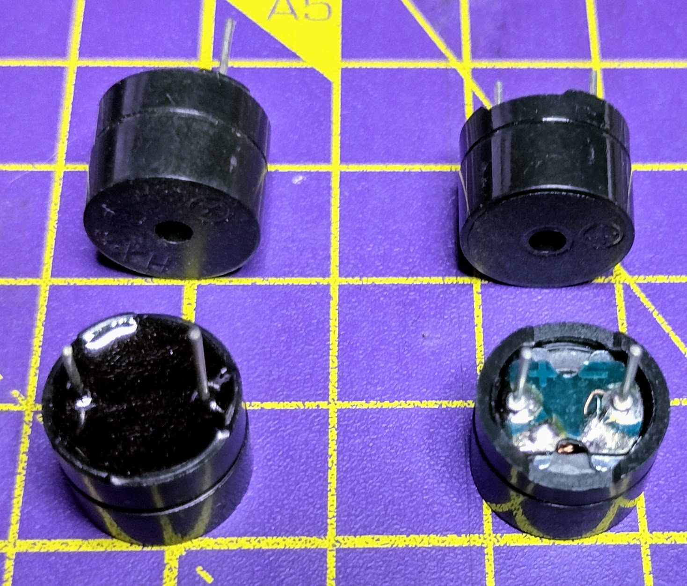

## Buzzers et haut-parleurs

Le son n'est qu'un déplacement dans l'air. Tout ce qui fait déplacer l'air peut produire un son.

- Les dispositifs mécaniques fonctionnent généralement en frappant deux morceaux de métal ensemble. Une cloche, par exemple, vibrera lorsqu'elle sera frappée et fera déplacer l'air qui l'entoure.
- Les appareils électromécaniques fonctionnent généralement en utilisant l'électricité pour déplacer une bobine de fil, ce qui provoque ensuite le déplacement très rapide d'un diaphragme et génère un son en déplaçant l'air autour de lui.
- Les dispositifs piézoélectriques utilisent le fait que certains matériaux changent de taille lorsqu'une tension leur est appliquée, et un changement rapide de tension les fait changer de taille très rapidement et déplace l'air autour d'eux.

Lorsqu'un matériau se déplace très rapidement, il produit des sons plus aigus. Lorsqu'un matériau bouge beaucoup, il produit des sons plus forts.

### Haut-parleurs et écouteurs

Les haut-parleurs et les écouteurs sont des appareils électromécaniques et comprennent une gamme d'appareils allant des énormes haut-parleurs que tu pourrais trouver lors d'un concert aux écouteurs que tu pourrais porter sur tes oreilles.

Pour faire fonctionner un haut-parleur, tu dois continuer à changer la tension à travers le haut-parleur. Plus tu changes la tension (fréquence) rapidement, plus le son sera aigu. Plus la tension (amplitude) est élevée, plus le son sera fort.

Les haut-parleurs et les écouteurs peuvent être connectés à l'aide de la prise casque.

Si tu utilises un haut-parleur, tu dois lui dire à quelle fréquence vibrer, pour créer le son que tu veux
### Buzzers

Les buzzers sont normalement des dispositifs piézoélectriques. Un buzzer normal est appelé **buzzer passif**. Comme un haut-parleur, la fréquence du changement de tension et le niveau de la tension modifieront le ton et le volume.

Si tu utilises un buzzer passif, tu dois lui dire à quelle fréquence vibrer, pour créer la tonalité que tu veux.

**Les buzzers actifs** contiennent des composants supplémentaires afin de toujours utiliser la même fréquence. Si tu utilises un buzzer actif, tu peux uniquement l'activer ou le désactiver, et tu ne peux pas modifier la tonalité. Les buzzers passifs sont affichés sur le côté droit de l'image ci-dessus.
