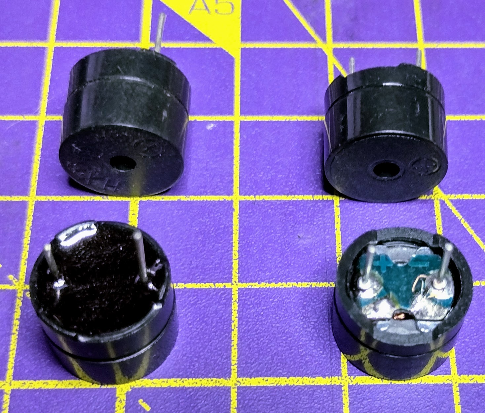

## Zoemers en luidsprekers

Geluid is slechts een beweging in de lucht. Alles wat de lucht doet bewegen, kan geluid maken.

- Mechanische apparaten werken meestal door twee stukjes metaal tegen elkaar te slaan. Een bel gaat bijvoorbeeld trillen als er tegenaan wordt geslagen en zorgt ervoor dat de lucht eromheen beweegt.
- Elektromechanische apparaten werken meestal door elektriciteit te gebruiken om een draadspoel te bewegen, waardoor een membraam zeer snel beweegt en geluid genereert door de lucht eromheen te bewegen.
- Piëzo-elektrische apparaten maken gebruik van het feit dat sommige materialen van grootte veranderen wanneer er een spanning op wordt toegepast, en een snelle verandering van de spanning zorgt ervoor dat ze heel snel van grootte veranderen en de lucht eromheen verplaatsen.

Wanneer een materiaal heel snel beweegt, produceert het hogere tonen. Wanneer een materiaal veel beweegt, produceert het luidere geluiden.

### Luidsprekers en koptelefoons

Luidsprekers en koptelefoons zijn elektromechanische apparaten en omvatten een reeks apparaten, van de enorme luidsprekers die je tijdens een concert kunt aantreffen tot de telefoons die je in je oren kunt dragen.

Om een luidspreker te laten werken, moet je de spanning over de luidspreker voortdurend veranderen. Hoe sneller je de spanning (frequentie) verandert, hoe hoger het geluid zal zijn. Hoe groter de spanning (amplitude), hoe luider het geluid zal zijn.

Luidsprekers en koptelefoons kunnen worden aangesloten via de koptelefoonaansluiting.

Als je een luidspreker gebruikt, moet je hem vertellen op welke frequentie hij moet trillen om de gewenste toon te creëren
### Zoemers

Zoemers zijn normaal gesproken piëzo-elektrische apparaten. Een normale zoemer wordt een **passieve zoemer**genoemd. Net als bij een luidspreker, zal de frequentie van de verandering in spanning en de grootte van de spanning de toonhoogte en het volume veranderen.

Als je een passieve zoemer gebruikt, moet je hem vertellen op welke frequentie hij moet trillen om de gewenste toon te creëren.

**Actieve zoemers** hebben extra componenten in zich zodat ze altijd dezelfde frequentie gebruiken. Als je een actieve zoemer gebruikt, kunt je deze alleen in- of uitschakelen en kun je de toon niet wijzigen. De passieve zoemers worden weergegeven aan de rechterkant van de afbeelding hierboven.